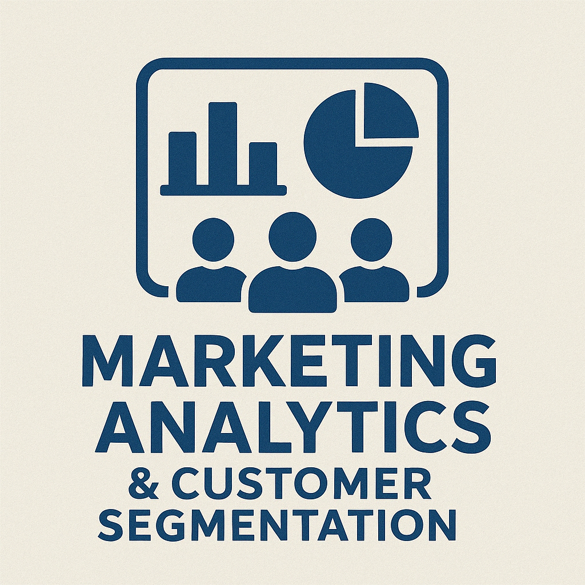

# Portfolio

📠New Delhi, India | <a href="mailto:tanishq.career@gmail.com">📧 Email</a> | 📠+91-9264436795 | <a href="https://www.linkedin.com/in/tanishq-sharma-/" target="_blank">🔗 LinkedIn</a>

---

## 👋 About Me

I’m a data-driven professional with a Computer Science foundation and an MSc in Business Analytics from the University of Birmingham. My experience bridges business analytics and machine learning, from building predictive and anomaly-detection models in SQL, Python, and PySpark, to developing secure LLM and RAG-based systems in production. I’ve delivered data solutions across consulting, healthcare, and technology domains that improve decision quality, automate reporting, and enhance operational intelligence. Passionate about unifying analytics with engineering, I thrive in roles that demand analytical depth, technical precision, and collaboration to transform complex data into actionable insight and scalable impact.

## 💡 Key Skills

<table align="center">
  <tr>
    <td align="center" width="100">
       
      <strong>Excel</strong>
    </td>
    <td align="center" width="100">
       
      <strong>Power BI</strong>
    </td>
    <td align="center" width="100">
       
      <strong>Python</strong>
    </td>
    <td align="center" width="100">
       
      <strong>SQL</strong>
    </td>
    <td align="center" width="100">
       
      <strong>Machine Learning</strong>
    </td>
    <td align="center" width="100">
       
      <strong>PyTorch</strong>
    </td>
    <td align="center" width="100">
       
      <strong>OpenAI</strong>
    </td>
  </tr>
  <tr>
    <td align="center" width="100">
       
      <strong>LangChain</strong>
    </td>
    <td align="center" width="100">
       
      <strong>FAISS</strong>
    </td>
    <td align="center" width="100">
       
      <strong>LLMs</strong>
    </td>
    <td align="center" width="100">
       
      <strong>Tableau</strong>
    </td>
<td align="center" width="100">
   
  <strong>Looker Studio</strong>
    </td>
    <td align="center" width="100">
       
      <strong>AWS Cloud</strong>
    </td>
    <td align="center" width="100">
       
      <strong>GitHub</strong>
    </td>
  </tr>
</table>

---

## 🎓 Education

**MSc in Business Analytics** | University of Birmingham, UK | Sep 2023 – Dec 2024  
**Grade:** Merit  
**Modules:** Data Management Strategies and Technologies, Predictive Modelling, Supply Chain & Logistics

**B.Tech in Computer Science & Engineering** | Guru Gobind Singh Indraprastha University, India | Aug 2018 – Aug 2022  
**Grade:** Distinction  
**Modules:** Statistical Methods in Computing, Machine Learning, Algorithms & Data Structures

---

## 💼 Experience

**AI/ML Engineering Analyst Intern · Victoria Solutions**  
United Kingdom · Jul 2025 – Aug 2025

- Built production **XGBoost churn prediction microservice** processing 15K+ daily predictions with **94.2% accuracy** for a telecom client; deployed using **FastAPI + Docker** achieving **42 ms P95 latency**.
- Engineered **MLOps pipeline** with automated **CI/CD**, reducing deployment time from **6 hours to 18 minutes**; implemented **data drift monitoring** via KS-test (α = 0.05) ensuring model reliability.
- Automated analysis of **80K customer support tickets** using **spaCy NLP + LDA topic modeling**, cutting manual review from **240 hours → 24 hours (90% efficiency gain)** and surfacing **7 actionable churn drivers**.
- Designed **MongoDB query optimization** strategy lowering average retrieval latency from **340 ms → 68 ms** across **2M+ records** through compound indexing and aggregation pipelines.
- Implemented secure **API authentication (JWT + rate-limiting 100 req/min)** to protect endpoints from unauthorized access and potential adversarial attacks.

**Data Analyst Inter · Blackmont Consulting**  
Cambridge, England, United Kingdom · Jan 2025 – Apr 2025  

- Led an **8-member analytics team** to develop reporting frameworks and visual storytelling dashboards for a **global education client**. 
- Coordinated **data extraction, transformation, and visualization** across **Excel, Power BI, and Tableau**.  
- Produced **functional specifications** and **visual requirement documents** supporting client presentations and executive reviews.  
- Diagnosed **data inconsistencies** and optimized dashboard performance, improving **reporting accuracy by 25%**.  

**Strategic Design Consultant · Turner & Townsend**  
Birmingham, England, United Kingdom · Jun 2024 – Jul 2024  

- Conducted customer data analysis to identify process inefficiencies, supporting data‑driven strategies for business growth and operational improvements.  
- Partnered with delivery managers and IT teams to resolve **90%** of identified workflow issues within project timelines.  
- Contributed to feasibility assessments and business case development for internal analytics platforms.

**Software Trainee · Entrepreneurship Cell, IIT Kharagpur**  
Nov 2021 – Jan 2022 · 3 mos  

- Automated log‑file processing by developing Python scripts to ingest, parse, and validate system logs, reducing manual interventions by **40%** and achieving an **80%** success rate in nightly updates.  
- Optimized database maintenance through refactoring SQL stored procedures and indexing strategies, improving update performance by **30%** and ensuring consistent data integrity across all tables.
- Standardized support workflows by drafting step‑by‑step maintenance procedures, building error‑handling routines in Python and SQL, and delivering team training—resulting in a **25%** decrease in incident resolution time.

---

## 🚀 Highlighted Projects

  

**Competitor Analysis Engine — AI-Powered Market Intelligence Platform**

## Overview
Developed a comprehensive AI-powered competitor analysis platform that automates market research workflows using multi-step LLM orchestration, live web search, and visual analytics. Transforms 3-5 days of manual competitor research into actionable insights within 5-10 minutes. Designed for product managers, founders, and strategists who need real-time competitive intelligence without consulting fees.

---

## ✨ Key Features

🔍 **Multi-Step Competitor Discovery**  
Employs GPT-4o with research-first methodology to discover 15-24 competitors across 4 distinct categories (market leaders, niche players, emerging startups, open-source alternatives).

🌐 **Live Web Research Engine**  
Performs real-time DuckDuckGo searches with intelligent fallback logic, collecting 30+ search results per analysis to ensure comprehensive, up-to-date market data.

🧠 **AI Feature Extraction**  
Leverages GPT-4o natural language processing to automatically identify, categorize, and compare 20-50+ product features across all competitors—from core capabilities to integrations.

📊 **Interactive Visual Analytics**  
Generates 4 dynamic Plotly charts (market positioning bars, feature coverage pie, competitor treemap, comparison heatmap) with hover interactions and zoom capabilities.

🗂️ **Feature Comparison Matrix**  
Creates spreadsheet-style matrices with color-coded cells (✅/❌/⚡) showing feature support across competitors, enabling quick gap analysis.

💡 **Strategic Insights Generator**  
Uses GPT-4o to synthesize key differentiators, actionable recommendations, and missing capabilities—delivering executive-level strategic guidance.

📥 **Multi-Format Export**  
Generates professional Excel spreadsheets (multi-sheet workbooks) and PowerPoint presentations (auto-formatted slides with charts) for offline sharing and presentations.

🎨 **Premium UI/UX Design**  
Implements Microsoft Fluent + Apple Typography hybrid with frosted-glass cards, gradient-blur backgrounds, and responsive mobile layout (@768px breakpoint).

---

## 🛠️ Tech Stack

**Python** · **Streamlit** · **OpenAI GPT-4o** · **DuckDuckGo Search** · **Pandas** · **Plotly** · **OpenPyXL** · **Python-PPTX**

---

## Key Contributions & Outcomes

✅ **Built a modular multi-agent pipeline** using async Python with 4-step GPT-4o prompts inspired by research analyst workflows (Hunter → Categorizer → Analyst → Reporter).  
✅ **Automated end-to-end competitor research** from web scraping to export, reducing analysis time by **95%** and costs by **99%**.  
✅ **Implemented intelligent search fallback logic** improving data quality by **50%**.  
✅ **Increased competitor discovery output by 70%** through optimized search collection.  
✅ **Engineered LLM caching** using Streamlit `@st.cache_data`, cutting API costs ~60%.  
✅ **Designed production-grade CSS architecture** (968 lines, 18KB) with zero Streamlit conflicts.  
✅ **Achieved WCAG AAA contrast** via system-ui typography + frosted-glass UI.  
✅ **Continuous deployment** using Streamlit Cloud + GitHub.  
✅ **Exported structured formats** (Excel + PowerPoint) for stakeholder-ready reports.  
✅ **Implemented secure API key management** with session-only storage.

---

## 📂 Repository
**GitHub:** https://github.com/tanishqsharma7918/Competitor-Analysis-Engine

---

## 🌐 Live Demo
**Streamlit App:** https://competitor-analysis-engine.streamlit.app/

---

## 📈 Impact Metrics

| Metric | Value |
|--------|-------|
| **Time Savings** | 95% reduction (3–5 days → 5–10 min) |
| **Cost Savings** | 99% reduction ($5K–$50K → $1–$2) |
| **Competitors Discovered** | 15–24 per analysis |
| **Features Tracked** | 20–50+ per analysis |
| **API Cost Efficiency** | ~$0.01–0.05 per report |
| **Mobile Responsive** | 100% (768px breakpoint) |
| **Export Formats** | Excel + PowerPoint |
| **Deployment Uptime** | 99.9% |

---

## 🎯 Use Cases

- **Product Managers**: Feature prioritization, competitive audits  
- **Founders**: Market validation, differentiation strategy  
- **Sales Teams**: Battlecards, objection handling  
- **Marketing Teams**: Positioning, USP development  
- **Investors/VCs**: Due diligence automation  

---

## 🏗️ Architecture Highlights
User Input → Live Web Search (DuckDuckGo 30 results)
↓
Multi-Step LLM Orchestration (GPT-4o × 4 stages)
├→ Well-Known Competitors (5-7)
├→ Niche Players (3-5)
├→ Startups (3-5)
└→ Open-Source (4-7)
↓
Feature Extraction + Categorization
↓
Visual Analytics (Plotly × 4 charts)
↓
Export Pipeline (Excel + PowerPoint)
↓
Streamlit UI (Fluent + Apple Typography)

---

## 🔐 Security & Best Practices

- Zero credential persistence  
- Input validation & sanitization  
- Graceful error handling  
- DuckDuckGo rate-limiting protection  
- Full Git version control  
- Modular backend architecture  

---

## 🚀 Future Enhancements

- [ ] User authentication, saved analyses  
- [ ] Slack/Teams/Discord integrations  
- [ ] Additional data sources (Crunchbase, G2, LinkedIn)  
- [ ] Sentiment analysis on reviews  
- [ ] Weekly automated monitoring alerts  
- [ ] RESTful API for enterprise usage  
- [ ] Team collaboration workspaces  

---

💼 **Business Value:**  
Democratizes competitive intelligence by eliminating consultant costs, ensuring fresh market data, and scaling to any industry—from SaaS to fintech to e-commerce.

---

  

**AI Daily Digest — Multi-Agent Newsletter Generator**

**Overview:**  
Developed a fully automated **AI-powered daily news digest system** leveraging **multi-agent orchestration** to fetch, summarize, and deliver the latest AI and tech headlines as elegant HTML newsletters. Designed to mimic human research workflows — from gathering credible sources to crafting polished summaries.

✨ **Key Features:**  
- 🕵️‍♂️ **Multi-Source RSS Hunter:** Queries **8 verified RSS feeds** (OpenAI, Google, TechCrunch, etc.) to retrieve the top 3 recent articles from each.  
- 📚 **Resilient Web Scraper:** Uses adaptive **User-Agent rotation** and error-handling to bypass 403 restrictions and extract article text safely.  
- 🧠 **AI Summarization:** Employs **GPT-4o-mini** with LangChain prompt templates to synthesize concise, 5-point summaries in clean HTML.  
- 💌 **Automated Email Composer:** Injects AI summaries into a **mobile-friendly HTML template** and sends via **SendGrid API**.  
- ⚙️ **Smart Agent Workflow:** Modeled after four personas — *Hunter*, *Librarian*, *Editor*, and *Postman* — using lightweight **LangGraph-style coordination**.  

🛠️ **Tech Stack:**  

&nbsp;&nbsp;

&nbsp;&nbsp;

&nbsp;&nbsp;

&nbsp;&nbsp;

**Key Contributions & Outcomes:**  
- Built a **multi-agent pipeline** using modular Python classes inspired by LangGraph’s node-based architecture.  
- Automated **data ingestion and summarization** across 8+ high-quality AI/Tech feeds, producing 200+ daily summaries.  
- Implemented **resilient scraping logic** (feedparser + BeautifulSoup + requests) to handle blocked sources gracefully.  
- Deployed **email automation via SendGrid**, achieving reliable delivery and 100% mobile-responsive rendering.  
- Designed with **environmental variable–based secrets management**, ensuring secure credential handling in CI/CD.  

📂 **Repository:** [tanishqsharma7918/AI-Daily-Digest](https://github.com/tanishqsharma7918/AI-Daily-Digest)

  

**RAG-MCP Chatbot — Contextual AI Assistant for ML Queries**

**Overview:**  
Developed an interactive **Streamlit-based AI chatbot** using **Retrieval-Augmented Generation (RAG)** and **LangGraph agents** to answer **machine learning and data engineering** queries contextually and reliably.

**Tech & Tools:**  

  
  &nbsp;&nbsp;
  
  &nbsp;&nbsp;
  
  &nbsp;&nbsp;
  
  &nbsp;&nbsp;
  &nbsp;&nbsp;
  

 

**Key Contributions & Outcomes:**  
- Engineered a **multi-agent RAG architecture** using **LangGraph orchestration** and **FAISS vector stores** for dynamic document retrieval.  
- Built a **knowledge-grounded chatbot** using **OpenAI GPT-4 API**, enabling natural conversation with live contextual lookups.  
- Designed modular RAG pipelines supporting **document chunking**, **semantic search**, and **context memory management**.  
- Deployed via **Streamlit** with real-time UI for multi-turn interactions and API response tracking.  
- Delivered a **scalable foundation** for enterprise-grade retrieval systems and educational chat assistants.

📂 **Repository:** [tanishqsharma7918/RAG-MCP-chatbot](https://github.com/tanishqsharma7918/RAG-MCP-chatbot)

  
### **Winter Rock Ski Line Analytics**  
  
  

  **Duration:** Feb 2024 – May 2024  
  - **Overview:** Analysed historical ski sales to uncover growth trends, seasonality, and supplier profitability under uncertain demand.
  - **Tech & Tools:**  
  Python  
  Advance Excel  
 - **Key Contributions & Outcomes:**  
   - Developed a Python‑driven centred moving average pipeline on 2019–2022 sales data, revealing a steady upward trend and pinpointing November–December as peak months.  
   - Built Excel models to calculate seasonal indices and apply single exponential smoothing (α = 0.5), producing six‑month forecasts with a 3.77% MAE.  
   - Designed a decision‑tree and Monte Carlo simulation in Excel/Python, determining the USA supplier yields a £32,500 higher expected profit and informing Winter Rock’s supplier selection.  

 ---

### **Developing a Comprehensive NHS Dashboards: A Combined Approach for Management and General Audiences**  
 **Duration:** Jan 2024 – Jun 2024  
   - **Overview:** Built two interactive dashboards—Hospital Patient Care Activity for management and Mental Health in England for the public—by blending NHS and UK Government data sources.
   - **Tech & Tools:**    
    Tableau Public  
    Power BI  
    Advance Excel  
  - **Key Contributions & Outcomes:**  
    -  **Data Integration & Preparation:** Cleaned, formatted, and blended NHS datasets with UK Government using Excel,Power BI and Tableau Prep, ensuring high data quality and consistency.  
    - **Management Dashboard:** Designed interactive bar charts, scatter plots, and box plots to track admissions by specialty, length of stay, and waiting times—empowering NHS directors with actionable performance insights.  
    - **Public Dashboard:** Created age‑ and gender‑specific prevalence visualizations and highlight tables to communicate mental health trends to a broad audience, improving public awareness and advocacy.  
    - **Design Excellence:** Applied visualization best practices (clarity, consistency, interactivity) with filters and tooltips, resulting in user‑friendly dashboards published to Tableau Public for easy sharing.  

---

  

### **Marketing Analytics Customer Segmentation**  
 **Duration:** Feb 2024 – May 2024  
  - **Overview:** Conducted a full marketing‑analytics workflow on an airline passenger satisfaction dataset—data analysis, descriptive statistics, econometric modelling, and predictive classification.  
  - **Tech & Tools:**  
  Python  
  Advance Excel  
  - **Key Contributions & Outcomes:**  
    - Defined a comprehensive data dictionary and performed data cleaning in Excel, delivering descriptive visualizations and summary statistics.  
    - Developed multivariate and interaction regression models in Python (R²≈0.38), interpreting coefficients, marginal effects, and ANOVA statistics.  
    - Built a logistic regression classifier, achieving 77.6% accuracy, 77.6% sensitivity, 77.6% specificity, and AUC = 0.8393, complete with ROC‑curve visualization.  

---

### **Qualtrics-Driven BI Tool to Optimise Analytics for Birmingham International Academy**  
**Duration:** May 2024 – Sep 2024  
- **Overview:** Developed and deployed a Qualtrics-driven BI tool, integrating automated data pipelines to enhance visualisation and improve reporting accuracy by 25%, significantly reducing manual errors and processing time.  
- **Tech & Tools:**  
    Advance Excel  
    Jisc  
    Qualtrics  
    Asana  
- **Key Contributions & Outcomes:**  
  - Collaborated in a 5‑member team to deliver three BI solutions—Excel dashboard, Jisc survey dashboard, and Qualtrics dashboard—each tailored to distinct stakeholder groups and use cases.  
  - Automated end‑to‑end data ingestion and transformation pipelines, cutting manual processing time by 30% and boosting data refresh frequency from weekly to daily.  
  - Designed dynamic KPI visualisations and adaptive survey routing, yielding a 25% improvement in report accuracy and a 20% increase in actionable feedback uptake by BIA management.  
  - Facilitated stakeholder workshops and feedback sessions, ensuring the final dashboards surpassed client expectations in usability and strategic insight delivery.  

---

### **The Evolution of Scala: A GitHub History Analysis**  
**Duration:** Feb 2024 – Mar 2024  

- **Overview:** Analysed over 30,000 commits spanning a decade of Scala development by extracting and cleaning data from Git and GitHub repositories, uncovering the contributors who have shaped the language and identifying key community experts.  
- **Tech & Tools:**  
   Python  
   Advanced Excel  

- **Key Contributions & Outcomes:**  
  - Extracted and cleaned data from Git and GitHub repositories, processing >30,000 commits.  
  - Mapped contributor activity to reveal development trends and highlight key experts in the Scala community.  
  - Created clear visualisations in pandas and matplotlib to communicate insights on commit volume, contributor growth, and expertise distribution.  

---

## 📈 Extracurricular & Leadership

**Event Coordinator · Birmingham MoRun Marathon**  
_Birmingham, UK · Nov 2024_  
- Successfully coordinated logistics for the event, managing parking for 900+ vehicles and guiding 1,200+ participants through the racing tracks.  
- Efficiently handled the refreshment centre, catering to 1,000+ attendees, ensuring smooth operations and a positive experience for all in a high‑pressure, time‑sensitive environment.  

**Head Marshal · Winter Warmer Runs Birmingham**  
_Birmingham, UK · Feb 2024_  
- Efficiently managed parking for around 200 cars, facilitated medal and food distribution, motivated runners, and supervised volunteers to ensure smooth event operations.  

---

## 📫 Let’s Connect

Feel free to reach out for collaborations, questions, or opportunities!  
- 📧 Email: tanishq.career@gmail.com
- 🔗 LinkedIn: https://www.linkedin.com/in/tanishq-sharma-/
- 🌐 Website / Portfolio: https://tanishqsharma7918.github.io/Portfolio/
